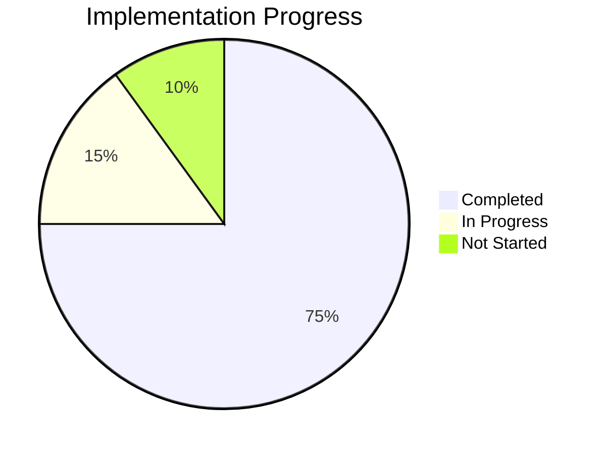

# VerifgoodSDK Progress

## Current Status

The VerifgoodSDK is currently in a functional state with core features implemented and working. It provides a TypeScript-based interface to the Verifgood API, with support for various services including Categories, Checkpoints, Equipements, Invitations, Lieux, SharedLinks, and Taches.

### Overall Progress: 75%

## What Works

### 1. Core Infrastructure (90% Complete)

- ✅ VGSDK main entry point
- ✅ HttpClient for API communication
- ✅ Auth for API key management
- ✅ Metadatas for query parameter handling
- ✅ ApiRequest base class for API requests
- ⚠️ Error handling (basic implementation, needs enhancement)

### 2. API Services (85% Complete)

- ✅ Categories service
- ✅ Checkpoints service
- ✅ Equipements service
- ✅ Invitations service
- ✅ Lieux service
- ✅ SharedLinks service
- ✅ Taches service
- ⚠️ Some services need more specific method implementations

### 3. Type Definitions (60% Complete)

- ✅ Core interface definitions
- ✅ Request interface definitions
- ⚠️ Response interface definitions (many use `any` instead of specific types)
- ❌ Comprehensive domain model interfaces

### 4. Documentation (70% Complete)

- ✅ API documentation generated with TypeDoc
- ✅ README with installation and basic usage
- ✅ Examples for common use cases
- ⚠️ Comprehensive guides and tutorials
- ❌ Interactive documentation

### 5. Testing (30% Complete)

- ⚠️ Unit tests (partial coverage)
- ❌ Integration tests
- ❌ End-to-end tests
- ❌ Automated CI/CD pipeline

## What's Left to Build

### 1. Enhanced Type Safety (Priority: High)

- Create specific interfaces for all API responses
- Replace `any` return types with specific interfaces
- Add comprehensive JSDoc comments for better IDE integration

### 2. Advanced Features (Priority: Medium)

- Implement offline support with caching
- Add request batching for performance
- Create helpers for common operations
- Add support for advanced filtering and sorting

### 3. Testing Infrastructure (Priority: High)

- Implement comprehensive unit tests
- Add integration tests for API interactions
- Set up CI/CD pipeline for automated testing
- Create test fixtures and mocks

### 4. Documentation Enhancements (Priority: Medium)

- Create comprehensive guides and tutorials
- Add more examples for complex scenarios
- Improve method documentation
- Create interactive documentation

### 5. Error Handling Improvements (Priority: High)

- Implement custom error classes
- Add retry mechanisms for transient failures
- Improve error messages and context
- Add error categorization

## Known Issues

1. **Type Safety Gaps**
   - Many API responses use `any` as the return type
   - Some parameters lack specific type definitions
   - Status: 🟠 In Progress

2. **Error Handling Limitations**
   - Basic try/catch blocks without sophisticated error handling
   - Limited error context in some scenarios
   - Status: 🟠 In Progress

3. **Documentation Gaps**
   - Some methods lack detailed documentation
   - Limited examples for complex scenarios
   - Status: 🟠 In Progress

4. **Testing Coverage**
   - Limited test coverage for core functionality
   - No automated testing pipeline
   - Status: 🔴 Not Started

5. **Performance Optimization**
   - No request batching for multiple operations
   - Limited caching mechanisms
   - Status: 🔴 Not Started

## Recent Achievements

1. **Invitations Service Enhancement**
   - Added support for generating invitation links
   - Implemented invitation validation
   - Added registration completion functionality
   - Date: March 2025

2. **Documentation Generation**
   - Generated comprehensive API documentation with TypeDoc
   - Added detailed examples
   - Date: February 2025

3. **Core Infrastructure Stabilization**
   - Improved error handling in HttpClient
   - Enhanced Metadatas class with more query capabilities
   - Date: January 2025

## Next Milestones

### Milestone 1: Type Safety Enhancement (Target: April 2025)

- Create specific interfaces for all API responses
- Replace `any` return types with specific interfaces
- Add comprehensive JSDoc comments

### Milestone 2: Testing Infrastructure (Target: May 2025)

- Implement unit tests for core functionality
- Add integration tests for API interactions
- Set up CI/CD pipeline

### Milestone 3: Error Handling Improvements (Target: June 2025)

- Implement custom error classes
- Add retry mechanisms
- Improve error messages and context

### Milestone 4: Documentation Completion (Target: July 2025)

- Create comprehensive guides and tutorials
- Add more examples for complex scenarios
- Improve method documentation
