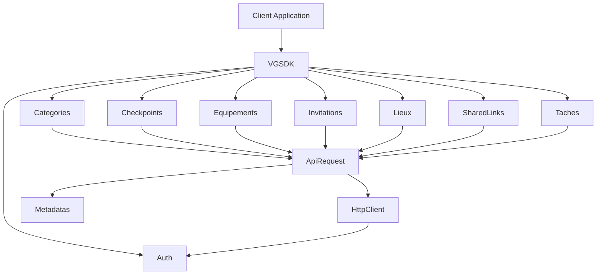

# VerifgoodSDK System Patterns

## System Architecture

The VerifgoodSDK follows a modular, layered architecture that separates concerns and promotes maintainability. The architecture consists of the following layers:

### 1. Core Layer

The core layer provides fundamental functionality used throughout the SDK:

- **VGSDK**: Main entry point that orchestrates access to all services
- **HttpClient**: Handles HTTP communication with the API
- **Auth**: Manages authentication and API keys
- **Metadatas**: Handles query parameters, filtering, and pagination
- **ApiRequest**: Base class for all API request handlers

### 2. Service Layer

The service layer contains specialized classes for each API domain:

- **Categories**: Manages category-related operations
- **Checkpoints**: Handles checkpoint data
- **Equipements**: Manages equipment-related operations
- **Invitations**: Handles user invitations and registration
- **Lieux**: Manages location-related operations
- **SharedLinks**: Handles shared link functionality
- **Taches**: Manages task-related operations

### 3. Types Layer

The types layer defines TypeScript interfaces for request and response objects:

- **Request interfaces**: Define the structure of API request payloads
- **Response interfaces**: Define the structure of API response data
- **Domain-specific interfaces**: Define domain objects like Category, Checkpoint, etc.

## Key Design Patterns

### 1. Facade Pattern

The VGSDK class serves as a facade, providing a simplified interface to the complex subsystem of API services. It hides the implementation details and provides a clean, high-level interface for clients.

```typescript
// Example of the Facade pattern
const vgsdk = new VGSDK(sdkConfig);
vgsdk.categories.getAll(metadatas); // Simple interface hiding complexity
```

### 2. Factory Method Pattern

The VGSDK class uses a factory method (`getService`) to create service instances on demand, ensuring lazy initialization and resource efficiency.

```typescript
// Factory method in VGSDK class
private getService<T>(serviceName: string, ServiceClass: new (auth: Auth, apiBaseUrl: string) => T): T {
  if (!this.services[serviceName]) {
    this.services[serviceName] = new ServiceClass(this.auth, this.config.apiBaseUrl);
  }
  return this.services[serviceName];
}
```

### 3. Template Method Pattern

The ApiRequest abstract class defines a template for API operations, with concrete implementations provided by specific service classes.

```typescript
// Template method pattern in ApiRequest
abstract class ApiRequest {
  abstract endpoint: string;
  
  async getAll(metadatas: Metadatas): Promise<any> {
    return this.get(this.endpoint, metadatas, {});
  }
  
  // Other template methods...
}
```

### 4. Builder Pattern

The Metadatas class implements a builder pattern for constructing complex query parameters with a fluent interface.

```typescript
// Builder pattern in Metadatas
const metadatas = new Metadatas()
  .setLimit(0, 25)
  .setFilter("type_tache", "Verification_equipement", "equals");
```

### 5. Singleton Pattern (Modified)

While not a pure singleton, the service instances in VGSDK are effectively singletons within the context of a single VGSDK instance, ensuring consistent state and resource efficiency.

```typescript
// Modified singleton pattern in VGSDK
get categories(): Categories {
  return this.getService('categories', Categories);
}
```

## Component Relationships



## Data Flow

1. **Client Request**: Client code calls a method on a VGSDK service
2. **Service Processing**: The service prepares the request parameters
3. **API Request**: The service calls methods on ApiRequest
4. **HTTP Communication**: ApiRequest uses HttpClient to send the request to the API
5. **Authentication**: HttpClient uses Auth to add authentication headers
6. **Response Handling**: HttpClient processes the API response
7. **Result Return**: The result is returned through the chain back to the client

## Error Handling Strategy

The SDK implements a consistent error handling strategy:

1. **API Errors**: HTTP errors from the API are caught and transformed into standardized error objects
2. **Logging**: Errors are logged with detailed information for debugging
3. **Promise Rejection**: Errors are propagated as Promise rejections for handling by client code
4. **Type Safety**: TypeScript helps prevent many errors at compile time

## Extensibility Points

The SDK is designed with several extensibility points:

1. **New Services**: Additional API services can be added by creating new classes that extend ApiRequest
2. **Custom Metadata**: The Metadatas class can be extended for custom query building
3. **Authentication Extensions**: The Auth class can be extended for more complex authentication scenarios
4. **HTTP Customization**: The HttpClient can be extended for custom request/response handling
